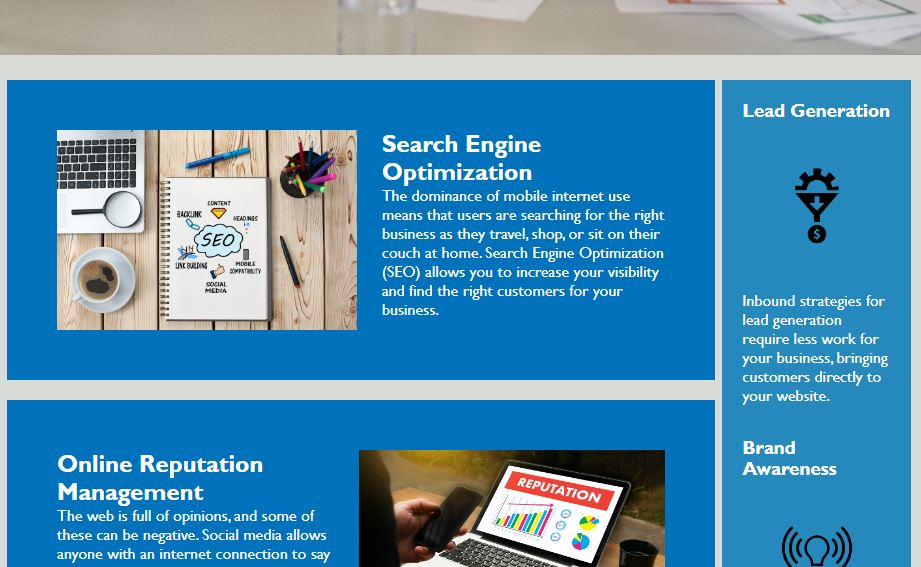

# Module 1 - Code refactor challenge

## Description

This is the boot camp module 1 challenge assignment.
This is an on the job ticket challenge.
A marketing agency has asked us to refactor their codebase to meet accessibilty standards.
And optimzed for search engines.

## Installation

Please click on the URL below to access the refactor challenge page.

## Usage 

To be viewed to see what improvements have been made to the basecode.

https://leegit11.github.io/Module-1-Challenge-Code-Refactor

## Credits

Followed guidance from W3 schools on HTML semantics
https://www.w3schools.com/html/html5_semantic_elements.asp

## License

No licence required.
